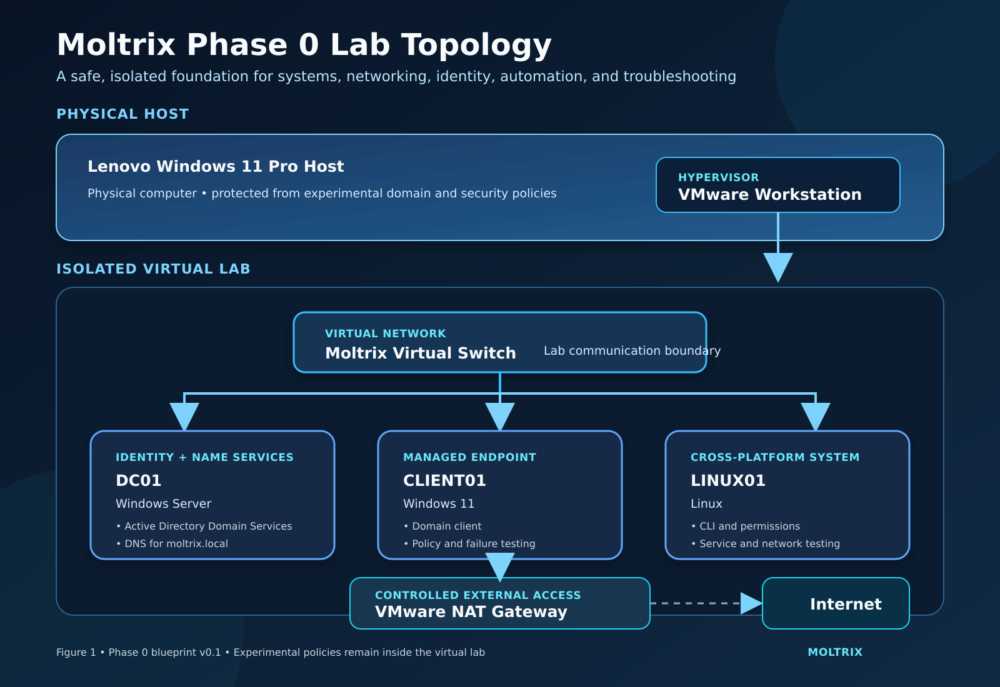

# Moltrix Cloud & AI Transformation Program

Moltrix is a connected professional transformation journey combining Anwar Ali’s finance leadership with Cloud, security, automation, platform engineering, and responsible Artificial Intelligence.

The objective is not to collect certifications. Each phase develops a capability required by the next phase, applies it to a realistic Moltrix business problem, and produces tested evidence that can be explained to professors, employers, and industry professionals.

## Current Build — Phase 0 Foundation Lab

Moltrix is currently building a safe Hyper-V environment for systems, networking, identity, automation, and structured troubleshooting.

[Explore the Phase 0 Learning and Lab Blueprint](docs/phase-0/phase-0-learning-and-lab-blueprint.md)

## Master Roadmap — Version 3.1

Version 3.1 is the locked executive roadmap governing the sequence, evidence standard, practical projects, and advancement gates.

- [View or download Roadmap V3.1 as PDF](docs/Moltrix_Cloud_AI_Roadmap_V3.1.pdf)
- [Download the editable Roadmap V3.1 Word document](docs/Moltrix_Cloud_AI_Roadmap_V3.1.docx)

## North Star

Anwar’s long-term direction is to become an AI-enabled enterprise Cloud professional who can:

- Design, build, secure, automate, monitor, and improve Cloud systems
- Deploy and govern Artificial Intelligence responsibly
- Connect technical performance to financial and business value
- Explain architecture, risk, cost, governance, and operational trade-offs
- Demonstrate every major professional claim through Moltrix evidence

Moltrix is the program used to reach that destination.

## Starting Position

Anwar brings 19 years of experience in:

- Finance and accounting
- Controls and audit
- Reporting and budgeting
- Cash flow and financial management
- Business leadership
- Governance and decision-making

The roadmap adds:

- Operating-system and networking foundations
- Identity and endpoint administration
- Microsoft 365 and Azure
- Automation and platform engineering
- Multi-cloud architecture
- Production AI engineering
- Enterprise transformation capability

## The Moltrix Story

Moltrix develops through a sequence of connected business and technical challenges:

1. Build the systems, networking, identity, and troubleshooting foundation.
2. Secure users, devices, applications, and organizational information.
3. Govern an AI-enabled Microsoft workplace.
4. Understand Cloud responsibility, governance, security, and cost.
5. Build and operate a secure Azure environment.
6. Make infrastructure reproducible through automation and platform engineering.
7. Deploy and govern AI as a production business capability.
8. Develop enterprise architecture judgment.
9. Build credible multi-cloud decision-making.
10. Connect Cloud and AI systems to measurable business transformation.

Each phase carries knowledge forward. No certification or project is treated as an isolated destination.

## Master Journey

| Phase | Business and professional challenge | Capability alignment | Moltrix proof |
|---|---|---|---|
| 0 — Continuous foundation | Prevent shallow Cloud knowledge and weak troubleshooting | Networking, DNS, identity, Windows, Linux, virtualization, permissions, Git, and automation | Moltrix OS & Network Lab and troubleshooting journal |
| 1 — Endpoint administration and security | Secure a distributed workforce without preventing productivity | MD-102 | [Moltrix Secure Endpoint Management](https://github.com/AnwarAliCloudAI/moltrix-secure-endpoint-management) |
| 2 — Microsoft 365 AI administration | Govern AI-enabled workplace services securely and responsibly | AB-900 foundation; AB-650 conditional on official scope | Moltrix AI Services Administration and Governance Lab |
| 3 — Azure fundamentals | Understand Cloud services, shared responsibility, governance, security, and cost | AZ-900 foundation | Moltrix Azure Foundation |
| 4 — Azure administration | Build and operate protected, monitored, and recoverable Azure infrastructure | AZ-104 | Moltrix Secure Azure Environment |
| 5 — Employability workstream | Convert progress into Canadian employment opportunity | Portfolio, demonstrations, communication, and applications | GitHub, professor checkpoints, résumé, LinkedIn, and interview stories |
| 6 — Platform engineering | Replace undocumented manual work with repeatable and secure delivery | Git, scripting, Bicep, Terraform, Docker, GitHub Actions, and monitoring | Moltrix Automated Cloud Deployment |
| 7 — Production AI engineering | Move AI from experimentation into secure and governed operation | Current Azure AI and applied AI path | Moltrix AI Operations Assistant |
| 8 — Azure architecture | Make defensible enterprise design decisions after operational experience | AZ-305 path | Moltrix Enterprise Azure Architecture |
| 9 — AWS architecture | Develop multi-cloud judgment after achieving Azure depth | AWS Solutions Architect — Associate path | Moltrix AWS Architecture and Azure–AWS comparison |
| 10 — Business AI and transformation | Connect technical systems to decisions, governance, adoption, and ROI | Finance + Cloud + AI leadership | Moltrix production business AI case |

> Credential names, objectives, availability, retirement notices, prerequisites, and exam codes will be verified through official providers before each phase is activated.

## Current Activation

### Phase 0 — Continuous Technical Foundation

Phase 0 is currently being strengthened before deeper MD-102 implementation.

[Read the Phase 0 Learning and Lab Blueprint](docs/phase-0/phase-0-learning-and-lab-blueprint.md)

Current foundation topics include:

- Operating systems
- Networking
- DNS
- Identity
- Active Directory
- Microsoft Entra ID
- Permissions
- Virtualization
- Git and GitHub
- PowerShell, Bash, and Python
- Structured troubleshooting

The Phase 0 exit gate requires Anwar to explain, build, test, troubleshoot, and connect these foundations to endpoint, Cloud, and AI operations.

### Phase 1 — Endpoint Administration and Security

MD-102 remains the active major certification.

The active evidence project is:

[Moltrix Secure Endpoint Management](https://github.com/AnwarAliCloudAI/moltrix-secure-endpoint-management)

Current project position:

- Business and security requirements documented
- Architecture decision pending completion of the relevant Phase 0 identity and networking foundations
- Practical Entra and Intune lab preparation follows the architecture decision
- Implementation evidence will include successful and failed tests
- Public screenshots will be sanitized before publication

### Phase 5 — Employability

Employability develops throughout the journey rather than waiting for every certification to be completed.

Every major project should produce:

- A professor-ready demonstration
- A résumé achievement
- An interview story
- A clear GitHub case study
- Evidence of business and technical communication

### AI Continuity

Artificial Intelligence is not postponed or abandoned during infrastructure study.

Five to seven hours each week are protected for AI continuity so prior Applied AI knowledge remains active and can later connect to secure Cloud deployment and governance.

## Ten-Part Moltrix Evidence Chain

Every major Moltrix project advances through:

1. Business problem
2. Official skill mapping
3. Architecture
4. Implementation
5. Security and governance
6. Testing
7. Troubleshooting
8. Operations and cost
9. AI extension where it materially improves the solution
10. Technical and executive communication

A certification validates knowledge. Moltrix evidence demonstrates professional capability.

## Advancement Standard

A phase is not complete merely because a course or examination is finished.

Anwar must be able to:

- **Explain** the purpose and trade-offs
- **Build** the solution
- **Secure** its boundaries
- **Test** successful and failed behaviour
- **Troubleshoot** using evidence
- **Document** decisions and lessons
- **Demonstrate** the result to a professor or employer

## Public Evidence Safety

Moltrix repositories will not publish:

- Passwords, tokens, API keys, or recovery codes
- Tenant or subscription identifiers
- Personal information
- Device serial numbers or hardware identifiers
- Unredacted administrative screenshots
- Confidential organizational information

Evidence sanitization is part of the professional standard.

## Current Progress

- [x] Professional GitHub identity established
- [x] Moltrix Cloud and AI Roadmap V3.1 published
- [x] Moltrix Secure Endpoint Management repository established
- [x] Endpoint project charter completed
- [x] Initial endpoint business and security requirements documented
- [ ] Complete the Phase 0 learning and lab blueprint
- [ ] Build the Phase 0 systems and networking lab
- [ ] Complete the endpoint identity and management architecture decision
- [ ] Publish the first architecture diagram
- [ ] Complete and document the first endpoint-management lab
- [ ] Present the first tested Moltrix control to the professor

## Roadmap Governance

- One major certification receives full-intensity preparation at a time.
- At least 40% of technical study time must be hands-on.
- Every major credential must produce practical Moltrix evidence.
- Advanced credentials remain deferred until their required operational experience exists.
- Future phases may be reordered after official credential, labour-market, cost, workload, and professor-feedback reviews.
- A smaller completed and tested project is stronger than unfinished exposure to many tools.

## Author

**Anwar Ali**
Finance professional building Cloud, AI, security, and enterprise-transformation capability
Email: anwar.cloudai@gmail.com
