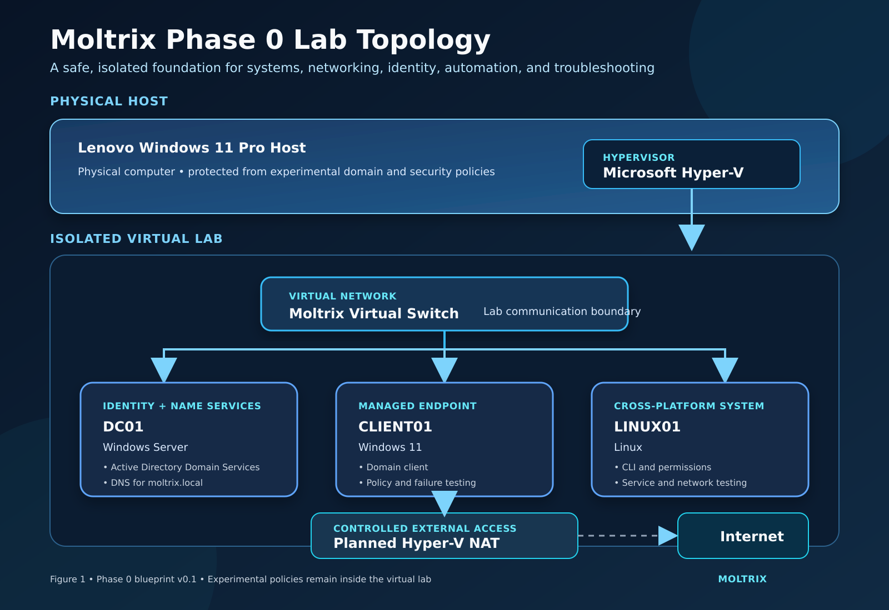

# Phase 0 Learning and Lab Blueprint

## Document Status

- **Version:** 0.1
- **Status:** Draft
- **Program:** Moltrix Cloud & AI Transformation Program
- **Phase:** Phase 0 — Continuous Technical Foundation
- **Current purpose:** Build the foundation required for endpoint, Cloud, automation, security, and AI work

## The Story Begins Here

Moltrix intends to secure endpoints, operate Cloud services, automate infrastructure, and eventually deploy responsible Artificial Intelligence.

None of those capabilities can be built reliably if the underlying systems are poorly understood.

A Cloud service still depends on operating systems, networks, names, identities, permissions, and processes. Microsoft Intune can distribute a policy, but the policy is ultimately evaluated and applied by a device. Microsoft Entra ID can identify a user or device, but access decisions still depend on authentication, authorization, network communication, and security state.

Phase 0 therefore addresses the first Moltrix risk:

> Moltrix cannot securely operate endpoints, Cloud services, automation, or AI systems if its technical decisions are built on weak systems and networking foundations.

Phase 0 is not an additional certification. It is prerequisite knowledge that supports every later roadmap phase.

## Central Phase 0 Question

> How do operating systems, networks, naming services, identity systems, permissions, virtualization, automation, and troubleshooting work together to support a secure Moltrix environment?

The answer must be demonstrated through explanation, implementation, testing, failure analysis, and evidence.

## Why Phase 0 Comes Before Deeper MD-102 Work

The Moltrix Secure Endpoint Management project asks how the organization can allow an authorized user to access company information from an acceptable device.

Answering that question requires more than learning the Intune interface.

Anwar must understand:

- How a Windows device operates
- How devices communicate across a network
- How DNS converts names into addresses
- How users and computers are represented as identity objects
- How authentication differs from authorization
- How policies reach and affect devices
- How local Active Directory differs from Microsoft Entra ID
- How traditional, Cloud-native, and hybrid environments relate
- How to investigate a failure using evidence

Phase 0 provides this foundation. Phase 1 applies it to Microsoft Entra, Intune, endpoint security, compliance, and access control.

## Phase 0 Position in the Moltrix Roadmap

Phase 0 supports the entire program:

| Later phase | Phase 0 knowledge carried forward |
|---|---|
| Endpoint administration | Windows, identity, DNS, policy, permissions, and troubleshooting |
| Microsoft 365 AI administration | Identity, access, devices, services, and governance |
| Azure fundamentals and administration | Networking, operating systems, DNS, identity, permissions, and automation |
| Platform engineering | Linux, scripting, Git, repeatability, testing, and troubleshooting |
| Production AI engineering | Compute, networks, identities, services, security, and operational evidence |
| Cloud architecture | System relationships, failure boundaries, security decisions, and trade-offs |
| Business transformation | Translating technical behaviour into risk, cost, control, and business value |

Phase 0 begins before deeper MD-102 implementation and continues as a lighter learning stream throughout the roadmap.

## The Moltrix Foundation Lab

The practical environment will be called:

**Moltrix Systems & Network Foundation Lab**

It will provide a safe environment in which Anwar can build, test, break, observe, and repair technical systems without affecting production resources.



An editable SVG version is also available in the [Phase 0 assets folder](assets/).

[Read the Host Capacity and Virtualization Decision](01-host-capacity-and-virtualization-decision.md)

## Initial Lab Architecture

| Component | Purpose |
|---|---|
| Lenovo Windows 11 Pro host | Physical computer running the learning environment |
| Microsoft Hyper-V | Native virtualization platform separating lab machines from the host |
| Moltrix virtual switch | Connects the virtual machines inside the lab network |
| DC01 — Windows Server | Provides Active Directory Domain Services and DNS |
| CLIENT01 — Windows 11 | Represents a company-managed Windows endpoint |
| LINUX01 — Linux | Supports command-line, service, permission, networking, and automation practice |
| Planned Hyper-V NAT | Provides controlled internet access without directly exposing the virtual machines |

This is the initial design. Configuration details will be finalized only after host capacity, software licensing, networking, and safety requirements are validated.

## Phase 0 Learning Chapters

### Chapter 0A — Inside the Computer

#### Story

Before Moltrix can manage a device, it must understand what the device is managing.

An operating system coordinates hardware, memory, storage, processes, services, users, files, and permissions. Endpoint policies ultimately change or evaluate this operating environment.

#### Questions

- What is the relationship between hardware, firmware, the operating system, applications, and users?
- What is a process?
- What is a service?
- How are files and permissions controlled?
- What information can Windows and Linux provide about their current state?

#### Practical work

- Inspect hardware, storage, memory, processes, and services
- Compare Windows and Linux system structures
- Create files, users, and permissions
- Start and stop a safe test service
- Record system information using graphical and command-line tools

#### Evidence

- System-layer diagram
- Windows and Linux command records
- Sanitized screenshots
- Comparison table
- Short explanation of why endpoint management depends on operating-system knowledge

### Chapter 0B — How Systems Communicate

#### Story

A secure identity or management service is useless if the device cannot reach it correctly.

Moltrix must understand how information moves between systems before diagnosing enrollment, policy, authentication, application deployment, or Cloud-service failures.

#### Questions

- What are IP addresses, subnet masks, gateways, and ports?
- What is the difference between a switch and a router?
- What happens when two devices communicate?
- What separates a local-network problem from an internet or service problem?

#### Practical work

- Inspect IP configuration
- Test local and external connectivity
- Trace a communication path
- Observe listening ports and active connections
- Create and diagnose controlled network failures

#### Evidence

- Network communication diagram
- IP addressing plan
- Connectivity test table
- Successful and failed test results
- Troubleshooting record

### Chapter 0C — Names and DNS

#### Story

People remember names, but computers communicate using addresses.

Moltrix services depend on DNS to locate domain controllers, Microsoft services, applications, and other resources. A DNS failure can appear to be an identity, network, or application failure.

#### Questions

- What is a hostname?
- What is a domain name?
- How does DNS translate a name into an IP address?
- Why does Active Directory depend on DNS?
- How can a DNS problem be distinguished from a general connectivity problem?

#### Practical work

- Query DNS records
- Compare successful and failed name resolution
- Inspect the configured DNS server
- Create a controlled DNS failure
- Restore correct resolution and document the reasoning

#### Evidence

- DNS-resolution diagram
- Query results
- Failed-resolution test
- Troubleshooting timeline
- Explanation of the connection between DNS, Active Directory, and Cloud services

### Chapter 0D — Identity, Directory Services, and Access

#### Story

Moltrix must know who or what is requesting access, verify the identity, and determine what that identity is allowed to do.

This chapter connects traditional Active Directory concepts to Microsoft Entra ID and prepares the identity decisions required by the endpoint project.

#### Questions

- What are a directory, domain, domain controller, object, attribute, container, organizational unit, and security group?
- What is the difference between authentication and authorization?
- How do user and computer objects represent real identities and devices?
- What is the difference between Active Directory Domain Services and Microsoft Entra ID?
- When are traditional, Cloud-native, or hybrid identity models appropriate?

#### Conceptual model

```text
moltrix.local — Active Directory domain
├── Finance OU
│   ├── Anwar — user object
│   └── FIN-PC-01 — computer object
├── HR OU
│   ├── Sarah — user object
│   └── HR-PC-01 — computer object
└── Security Groups
    ├── Budget-Managers
    └── HR-Managers
```

The organizational unit arranges and helps administer objects. The security group helps grant access to resources. An attribute stores information about an object, such as a user’s job title.

#### Practical work

- Install the Active Directory Domain Services role
- Promote DC01 to a domain controller
- Configure the `moltrix.local` learning domain
- Create organizational units
- Create test users, computers, and security groups
- Join CLIENT01 to the domain
- Test successful and unsuccessful authentication
- Apply and validate a simple Group Policy
- Compare the lab model with Microsoft Entra identity concepts

#### Evidence

- Active Directory structure diagram
- Identity and access flow
- Sanitized object and group records
- Authentication and authorization test table
- Group Policy validation
- Architecture comparison and conclusion

### Chapter 0E — Virtualization and Safe Experimentation

#### Story

Moltrix needs a controlled environment where mistakes become evidence instead of incidents.

Virtualization allows several isolated systems to run on one physical computer. It makes repeated testing, snapshots, restoration, and controlled failure possible.

#### Questions

- What is a host?
- What is a virtual machine?
- What is a hypervisor?
- How do virtual networks connect or isolate machines?
- What are the limits of snapshots and backups?

#### Practical work

- Validate host capacity
- Validate and configure Microsoft Hyper-V
- Build the three planned virtual machines
- Configure the virtual network
- Test isolation and internet access
- Create and restore a safe snapshot

#### Evidence

- Lab topology diagram
- Host-capacity assessment
- Virtual-machine inventory
- Network configuration record
- Snapshot and recovery test

### Chapter 0F — Automation and Version Control

#### Story

Manual work can teach a concept, but repeatable work demonstrates operational maturity.

Moltrix will use PowerShell, Bash, Python, Git, and GitHub to record, repeat, test, and explain selected technical tasks.

#### Questions

- When should a task remain manual while learning?
- When is automation valuable?
- How do scripts reduce inconsistency?
- How does Git preserve change history?
- What information must never be committed publicly?

#### Practical work

- Use PowerShell to inspect Windows configuration
- Use Bash to inspect Linux configuration
- Create a small safe reporting script
- Store scripts and documentation in Git
- Review changes before committing
- Test the script and record its limitations

#### Evidence

- Sanitized scripts
- Command output
- Git history
- Test results
- Explanation of manual versus automated work

### Chapter 0G — Troubleshooting as Professional Evidence

#### Story

A working screenshot proves that a system worked once. A troubleshooting record demonstrates that Anwar understands how the system behaves.

Moltrix will deliberately create controlled failures and use evidence to isolate their causes.

#### Troubleshooting method

1. Define the observed symptom.
2. Identify the expected behaviour.
3. Gather facts without immediately changing the system.
4. Form a testable hypothesis.
5. Change one relevant variable.
6. Test again.
7. Record the result.
8. Restore or improve the system.
9. Explain the root cause and prevention.

#### Required controlled failures

At least three failures will be created and resolved, including examples from:

- Network connectivity
- DNS resolution
- Authentication or authorization
- Service availability
- Policy application

#### Evidence

- Troubleshooting journal
- Before-and-after test results
- Root-cause explanations
- Corrective actions
- Lessons carried into later Moltrix phases

## Phase 0 Evidence Structure

The project evidence will be organized around the story:

```text
business problem
    ↓
technical concept
    ↓
architecture decision
    ↓
implementation
    ↓
successful test
    ↓
controlled failure
    ↓
troubleshooting
    ↓
lesson and roadmap connection
```

Evidence will demonstrate understanding rather than simply record course completion.

## Public Evidence Safety

The following information will not be published:

- Passwords or authentication secrets
- API keys, tokens, or recovery codes
- Tenant or subscription identifiers
- Personal information
- Device serial numbers or hardware identifiers
- Unredacted administrative screenshots
- Private IP information when its publication creates unnecessary risk
- Confidential organizational information

Screenshots and command output must be reviewed and sanitized before publication.

## Professor-Ready Demonstration

The Phase 0 demonstration should allow Anwar to explain:

1. The business risk Phase 0 addresses
2. The lab architecture and the purpose of every component
3. How CLIENT01 communicates with DC01
4. Why Active Directory depends on DNS
5. How authentication differs from authorization
6. How a policy reaches and affects a device
7. How Windows, Linux, and networking knowledge connect to Cloud services
8. One successful implementation
9. One controlled failure and its diagnosis
10. How the learning prepares Moltrix for MD-102 and later roadmap phases

## Phase 0 Completion Gate

The intensive Phase 0 foundation cycle is complete when Anwar can:

- [ ] Explain the relationship between hardware, operating systems, services, applications, and users
- [ ] Inspect and compare essential Windows and Linux system behaviour
- [ ] Explain and test IP addressing, gateways, ports, and network paths
- [ ] Explain and troubleshoot DNS resolution
- [ ] Explain directory, domain, domain controller, object, attribute, container, OU, and security group
- [ ] Distinguish authentication from authorization
- [ ] Explain traditional Active Directory, Microsoft Entra ID, and hybrid identity at a foundation level
- [ ] Build and operate the planned virtual lab safely
- [ ] Join a Windows client to the learning domain
- [ ] Create and validate a simple Group Policy
- [ ] Use PowerShell and Bash for inspection and evidence
- [ ] Use Git and GitHub to manage sanitized project evidence
- [ ] Diagnose at least three controlled failures using a structured method
- [ ] Connect each foundation area to MD-102, Azure, platform engineering, or AI operations
- [ ] Demonstrate the integrated lab to a professor

Completing this gate does not end Phase 0. Foundation development continues throughout the Moltrix roadmap as later projects introduce deeper requirements.

## Current Position

- [x] Phase 0 business purpose defined
- [x] Initial learning chapters designed
- [x] Initial lab topology designed
- [x] Host capacity validated
- [x] Hyper-V selected, enabled, and verified
- [ ] Guest operating-system licensing and evaluation rights validated
- [ ] Detailed lab requirements documented
- [ ] Lab software and operating-system sources approved
- [ ] Virtual network addressing plan completed
- [ ] DC01 built
- [ ] CLIENT01 built
- [ ] LINUX01 built
- [ ] Integrated lab tested
- [ ] Controlled failures documented
- [ ] Professor-ready demonstration completed

## Immediate Next Design Gate

The host-capacity and virtualization-platform decisions are complete.

Before creating any virtual machine, Moltrix will now define:

- Hyper-V virtual-switch purpose and type
- Lab network isolation and controlled internet access
- IP-addressing and subnet plan
- DNS sequence and dependency
- Host and guest memory allocations
- Virtual-disk and checkpoint strategy
- Windows Server evaluation availability and permitted use
- Windows 11 virtual-machine licensing
- Linux distribution and approved download source
- Evidence and rollback requirements

The outcome will determine how DC01, CLIENT01, and LINUX01 communicate safely and how each networking layer will be tested before directory services are introduced.
